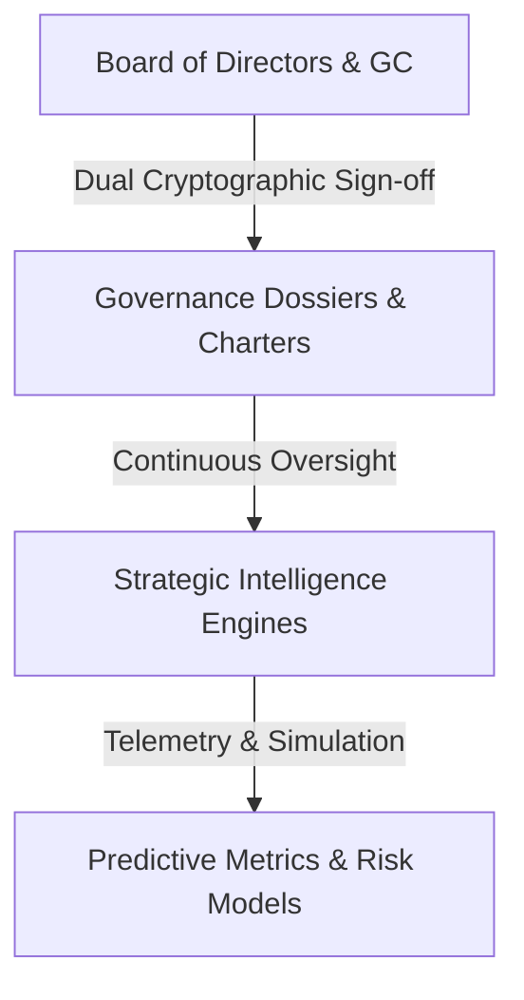

# JurisTech Solutions — Strategic Governance & Board Oversight Charter
**Version**: 1.0.0 (v18.0+ Strategic Operations & Intelligence Series)  
**Standard**: OECD AI Principles, Saudi SDAIA AI Ethics, ISO/IEC 38500 (Corporate Governance of IT)

---

## 1. Executive Board Oversight Mandate

All predictive intelligence, systemic risk modeling, and strategic compliance automation within JurisTech Solutions operate under the sovereign authority of the Board of Directors and the General Counsel.

---

## 2. Inviolable Governance Principles

1. **Human-in-the-Loop Supremacy**:
   No strategic recommendation or risk mitigation plan may be enacted autonomously. Execution requires explicit human authorization.
2. **Dual-Key Attestation**:
   All board dossiers and regulatory attestations must bear digital cryptographic verification from both the General Counsel and the Chief Information Security Officer (CISO).
3. **Zero Raw Customer Data Retention**:
   In strict accordance with Rule Zero, strategic intelligence aggregates mathematical risk vectors, cryptographic hashes, and statistical indices without persisting raw client contracts or confidential prompts.
