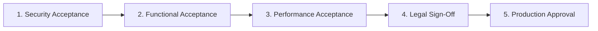

# JurisTech Solutions — Enterprise Customer Acceptance Testing (UAT) Criteria
**Version**: 1.0.0 (v15.0+ Enterprise Trust & Scale Series)  
**Standard**: ISO/IEC 25010 Software Quality, NIST SP 800-53, Saudi National Cybersecurity Authority (NCA)

---

## 1. 5-Stage Enterprise UAT Lifecycle

---

## 2. Acceptance Test Categories & Pass Criteria

| Category | Test Vector | Mandatory Pass Threshold | Verification Method |
| :--- | :--- | :--- | :--- |
| **Security & Privacy** | Multi-Tenant Bleed & Delimiter Injection | 100% Blocked (0 Data Leaks) | Adversarial Security Suite Simulation |
| **Data Retention** | Ephemeral RAM Purge | 0 Bytes Saved to Permanent Disk | Cryptographic Memory Overwrite Check |
| **Statutory Grounding** | Saudi / GCC Legal Articles | 100% Citation Grounding in Lexicon | Hallucination Guard Intercept |
| **Latency SLA** | 50 Concurrent Swarm Syntheses | $\text{P95} \le 20.0\text{ms}$ | Production Observability Center Telemetry |
| **Disaster Recovery** | Cross-Region Node Failover | $\text{RTO} \le 1.0\text{s}, \text{RPO} = 0$ | Multi-Region Reliability Simulation |

---

## 3. Governance Dual Authorization Protocol

Final deployment cutover to production requires dual cryptographic sign-off:
1. **Client General Counsel & CISO Signature**
2. **JurisTech Solutions Enterprise Lead Architect Signature**
